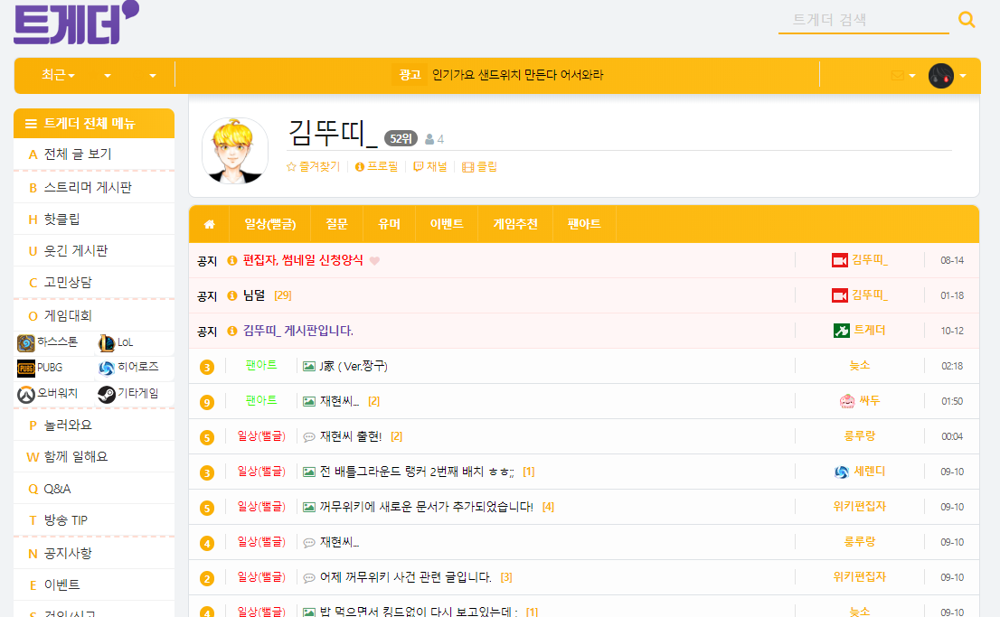
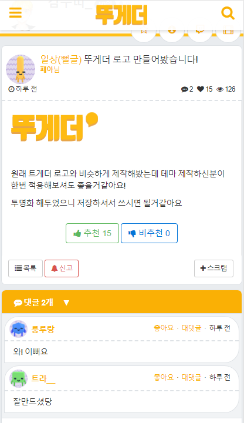
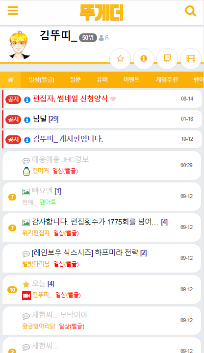

# 김뚜띠 트게더 테마

> css 버젼 파일 보기를 누르신뒤 복사하신뒤 붙혀넣으셔서 적용하실 수 있습니다.

SASS 로 제작되었습니다.

김뚜띠님을 대표하는 색상인 노랑색에 맞춰 제작해 보았습니다.
채도가 높아 눈에 부실 수 도 있는데 불편하신 점이나 마음에 안드시는 부분 이야기 해주시면 수정해 드리겠습니다.

제가 이미지 제작을 할 줄 몰라서 트게더 로고는 원본으로 되어있습니다.
이후 다른 능력자분이 만들어 주신다면 수정하겠습니다.

## 적용방법

### 윗칸 (데스크톱 뷰 CSS)

```css
@import url("https://k22pr.github.io/static/Tgd-Theme/theme/kimdduddi/styles/index.min.css");
```

### 아래칸 (모바일 뷰 CSS)

```css
@import url("https://k22pr.github.io/static/Tgd-Theme/theme/kimdduddi/styles/mobile.min.css");
```

### 미리보기




---

## 모바일

### 미리보기



