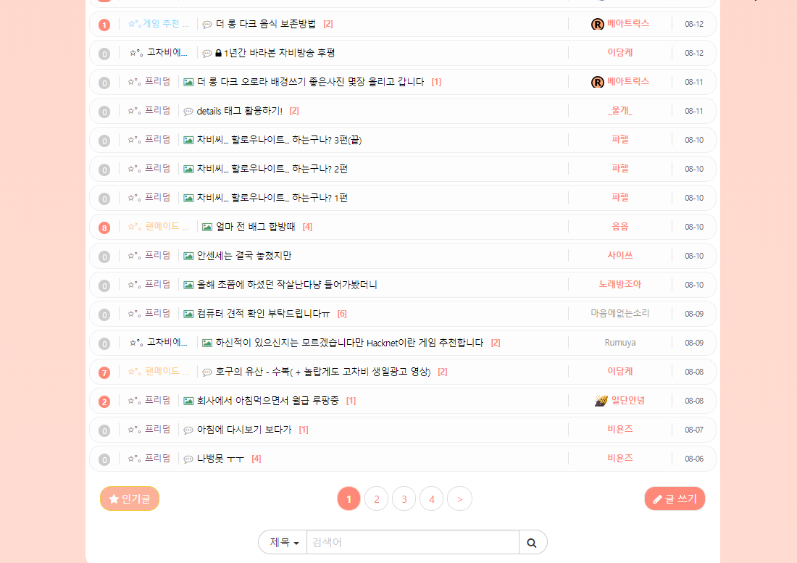
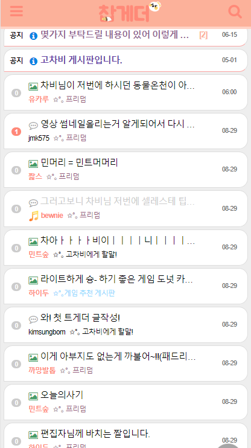
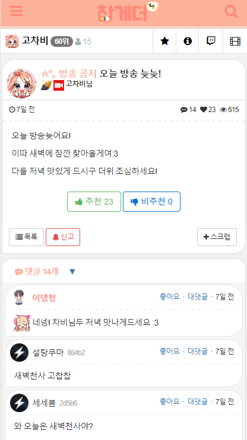

# 고차비 트게더 테마

> css 버젼 파일 보기를 누르신뒤 복사하신뒤 붙혀넣으셔서 적용하실 수 있습니다.

SASS 로 제작되었습니다.

고차비님이 수정하신 색상등은 그대로 유지하고 잘 보이지 않던 글자들의 가독성을 높혔습니다.

## 적용방법

### 윗칸 (데스크톱 뷰 CSS)

```css
@import url("https://k22pr.github.io/static/Tgd-Theme/theme/kumikomii/styles/index.min.css");
```

### 아래칸 (모바일 뷰 CSS)

```css
@import url("https://k22pr.github.io/static/Tgd-Theme/theme/kumikomii/styles/mobile.min.css");
```

---

### 미리보기




---

### 미리보기



