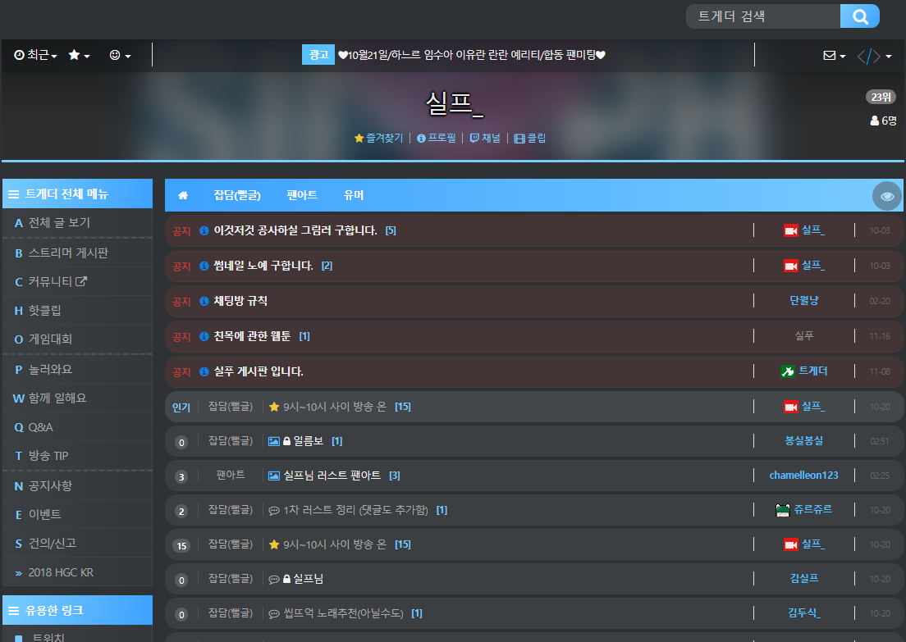
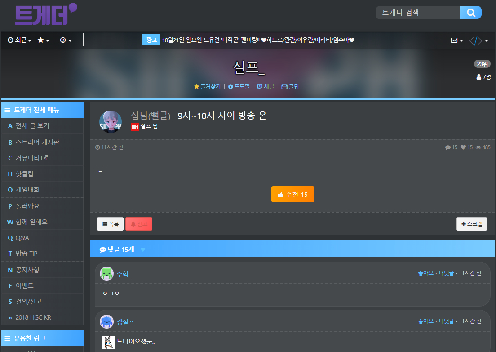
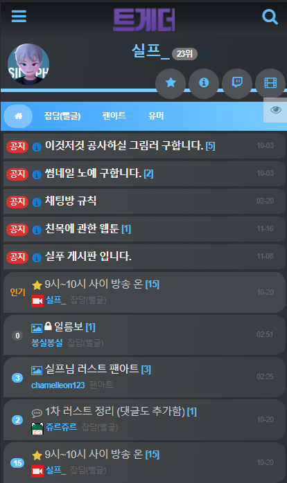

<h1 align="center">실프_ 트게더 테마</h1>
<p align="center">
    SASS(syntactically awesome stylesheets) 로 제작되었습니다.<br>
</p>

## 적용방법

### 윗칸 (데스크톱 뷰 CSS)

```css
@import url("https://k22pr.github.io/static/Tgd-Theme/theme/silphtv/styles/index.min.css");
```

### 아래칸 (모바일 뷰 CSS)

```css
@import url("https://k22pr.github.io/static/Tgd-Theme/theme/silphtv/styles/mobile.min.css");
```

---

### 미리보기




---

### 모바일 미리보기



